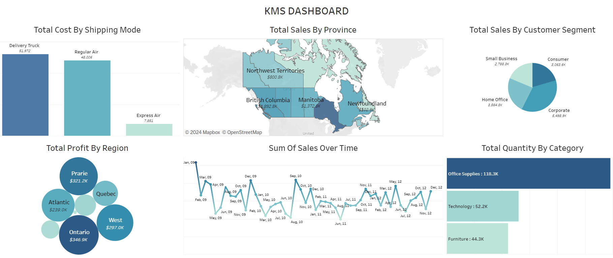
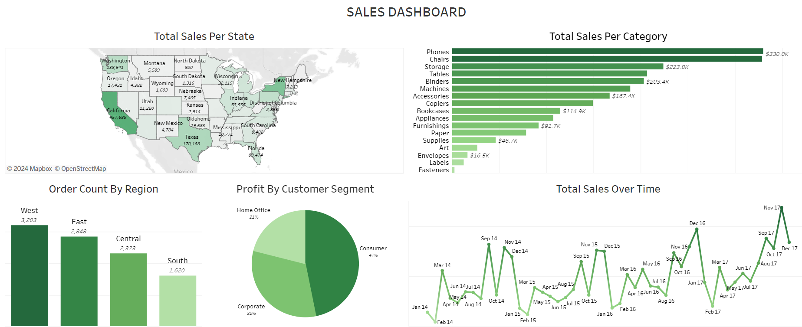
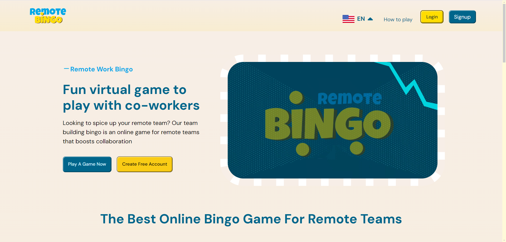

<h1 align="center">
  
</h1>

## Who I am:

Ever wondered how it feels to predict the future using data? That curiosity led me to Data Science. My journey began with an internship focused on machine learning models for drug discovery. That first experience sparked a passion that still drives me today.

My journey as a Tester began with a previous role. As a Backend Developer on the ZuriChat project, I periodically reviewed our software to assess its functionality and provide detailed reports on all the bugs found. I loved viewing the software from the user’s perspective, which eventually sparked my interest in Quality Assurance testing.

## What I Do:

### `Data Science Expertise`

- Transform complex datasets into insights.
- Develop predictive models to guide strategic decisions.
- Create visualizations to tell compelling data stories.
- Apply statistical analysis to validate findings.
- Forecast future outcomes to drive business growth.

### `Quality Assurance Testing`

- Implemented comprehensive manual and automated testing strategies
- Conducted thorough API and End-to-end (E2E) testing
- Optimized software performance with load and stress testing.
- Identified and resolved defects with precision and accuracy.

I've learned that success in both fields requires more than technical skills. It's about asking the right questions, thinking creatively, and effectively communicating complex ideas.

I'm a creative team player and results-oriented leader with a track record of effectively leading multiple teams to success in various internships, one of which ultimately won a blockchain hackaton. I believe in giving back and one of my passions is volunteering. I also contribute actively to open source projects, so if you have an amazing project, reach out, let's collaborate!

  
<strong>Click me!</strong>

  

  ### **`Data Projects`**
  - 
Superstore Analysis
 
    

     
    
  - 
KMS Dashboard
 
    

     

  - 
Maji Ndojo dashboard
 
    
    
     
    
  - 
Sales Dashboard
 
    
    
     
    
  - 
Water Analysis
 
    
    
     
    
    

  ### **`Software QA Projects`**
  - #### **`Remote Bingo Project`**

    The Remote Bingo project is an online platform that allows users to create and join virtual Bingo games, offering real-time participation and a user-friendly experience across devices.
    - 
Bingo APIs report
 
      
      
       
    
    - 
Bingo E2E report
 
      
    
       

    - 
Bingo API tests
 
      
      
       
    
    

  - #### **`HNG Boilerplate Project`**

    The HNG Boilerplate is a pre-configured starter template that helps developers quickly set up scalable web applications with essential tools for testing, linting, and deployment.
    
    - 
Boilerplate Regression Report
 
      

       
    
    - 
Boilerplate API tests
 
          
  

&nbsp;&nbsp;

  
  
  

#

<h2 align="center"> Languages - Tools 📚 </h2>

    

        
---

<h2 align="center"> Technical Skills 💼 </h2>

  
  
  
  
  
  
  
  
  
  
  
  
  
  
  
  

---

<h2 align="center">  GitHub Stats🚀 </h2>

&nbsp;

#

<h2 align="center"> Programming Stack 💻 </h2>

  

---

<h2 align="center">  GitHub Streak 🔥 </h2>

&nbsp;

#

<h2 align="center">  Contributions 👷🏻‍♀️ </h2>

  

&nbsp;

#

<h2 align="center">  GitHub Trophies 🏆 </h2>

  

&nbsp;
    

If you want to hire me or just chat, reach out! 

  
  
  

