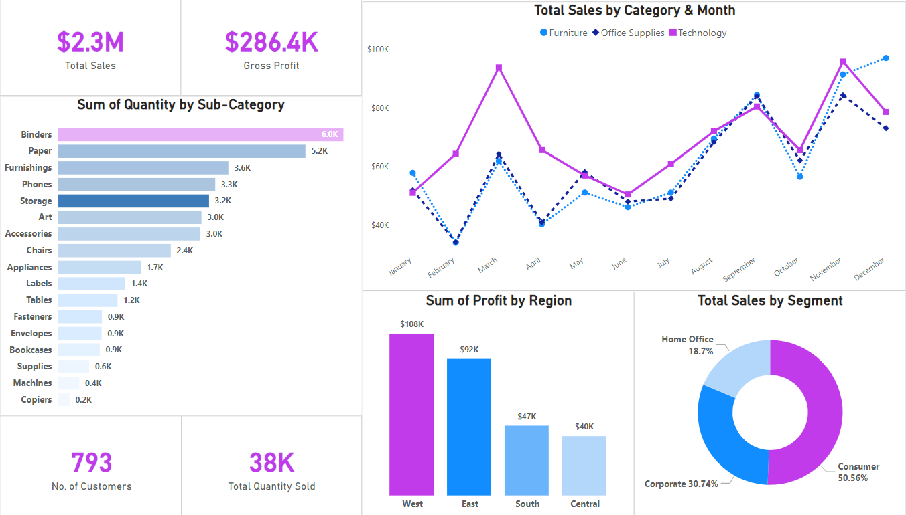
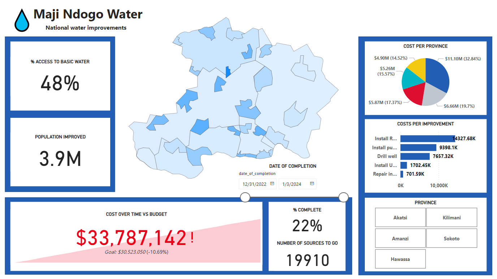
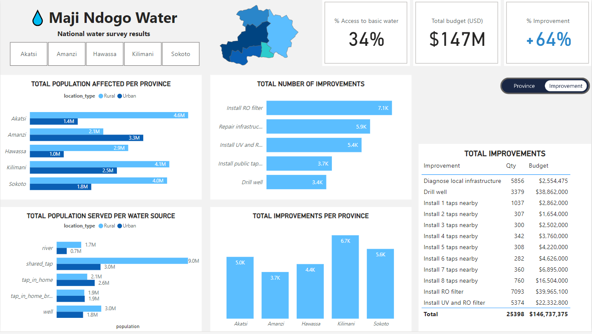
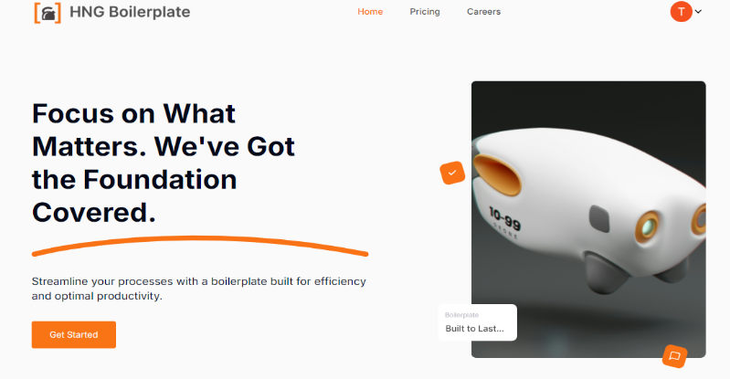

<!-- HEADER SECTION -->

  

    

      <!-- NAME INFO -->
      
      <!-- HEADER GIF -->
      
      <!-- CHANGING TEXT -->
      
    

  

  

  <!-- WHO I AM SECTION -->
  <h2 style="font-variant: small-caps; font-weight: bold; align:center; color:#c799ff;">
     
    Who I am:
  </h2>

  

    

      Ever wondered how it feels to predict the future using data? That curiosity led me to Data Science. My journey began with an internship focused on machine learning models for drug discovery. That first experience sparked a passion that still drives me today.
    

    

      My journey as a Tester began with a previous role. As a Backend Developer on the ZuriChat project, I periodically reviewed our software to assess its functionality and provide detailed reports on all the bugs found. I loved viewing the software from the user’s perspective, which eventually sparked my interest in Quality Assurance testing.
    

  

  

  <!-- WHAT I DO SECTION -->
  <h2 style="font-variant: small-caps; align:center; color:#c799ff; font-weight:bold;">
    What I Do:
  </h2>

  <!-- DATA SCIENCE SECTION -->
  ### `Data Science Expertise`

  <table style="font-size: 1.2em; border: none;"> 
    <tr border="none" align="center">
      <td width="50%">
        
      </td>
      <td border="none" width="50%">
        <ul>
          <li>
            Transform complex datasets into insights.
          </li>
          <li>
            Use Machine Learning algorithms to develop predictive models.
          </li>
          <li>
            Create visualizations to tell compelling data stories.
          </li>
          <li>
            Apply statistical analysis to validate findings.
          </li>
          <li>
            Forecast future outcomes to drive business growth.
          </li>
        </ul>
      </td>
    </tr>
  </table>

  ---

  <!-- QA SECTION -->
  ### `Quality Assurance Testing`

  <table style="font-size: 1.2em; border: none;"> 
    <tr style="border: none;">
      <td width="50%" border="none">
        <ul>
          <li>
            Implement comprehensive manual and automated tests.
          </li>
          <li>
            Conduct thorough API and End-to-end (E2E) testing.
          </li>
          <li>
            Integrate Postman test scripts into CI/CD pipelines for automated API status monitoring.
          </li>
          <li>
            Optimize software performance with load and stress testing.
          </li>
          <li>
            Identify and report software usability and accessibility issues.
          </li>
      </ul>
      </td>
      <td border="none" width="50%">
        
      </td>
    </tr>
  </table>
  
  ---
  

    

      I've learned that success in both fields requires more than technical skills. It's about asking the right questions, thinking creatively, and effectively communicating complex ideas.
    

    

      I'm a creative team player and results-oriented leader with a track record of effectively leading multiple teams to success in various internships, one of which ultimately won a blockchain hackaton. I believe in giving back and one of my passions is volunteering. I also contribute actively to open source projects, so if you have an amazing project, reach out, let's collaborate!
    

  

<!-- PROJECTS SECTION (HIDDEN) -->
  <!-- DROPDOWN -->
  

    

      <strong>
        Click me!
      </strong>
    

    ---
  <!-- DATA PROJECTS -->
  ### **`Data Projects`** 

  

    <ul>
      <li>
        

          <a href="https://github.com/paulinebanye/bengaluru_prediction"> 
            <strong>
              Bengaluru House Price Prediction
            </strong>
          </a>
          

            The Bengaluru House Price Prediction project uses machine learning to predict house prices in Bengaluru, India. It analyzes various features such as location, size, and amenities to provide accurate price estimates for potential buyers and sellers.
          

          
        
 
      </li>
      <li>
        

          <a href="https://app.powerbi.com/view?r=eyJrIjoiMjBmZmM5MTYtMGRmMi00MGIzLThjZmUtNDZlYzMxNjFmYTk0IiwidCI6ImRmODY3OWNkLWE4MGUtNDVkOC05OWFjLWM4M2VkN2ZmOTVhMCJ9">  
            <strong>
              Superstore Analysis
            </strong>
          </a>
          

            The Superstore Analysis project studies retail data from a store to identify trends in sales, profits, and customer behavior. It provides insights that can improve inventory management, marketing strategies, and regional performance.
          

          
        

      </li>
      <li>
        

          <strong>
            Maji Ndojo Water Analysis
          </strong>
          

          This project is an analysis of the Maji Ndojo dataset, which contains information about water quality and availability in various regions. The analysis provides insights into the water quality and availability in the rural and urban regions, and identifies areas where people struggle to get clean water. The goal is to use the information to help improve water access in these communities.
          

          <ul>
            <li>
              

                <a href="https://app.powerbi.com/view?r=eyJrIjoiMDAwN2JjNzQtOTllMi00OGYyLWI5N2MtMmRkZTMwODdlZWQ5IiwidCI6ImRmODY3OWNkLWE4MGUtNDVkOC05OWFjLWM4M2VkN2ZmOTVhMCJ9">
                  <i>
                    Initial Analysis (Pre improvements)
                  </i>
                </a>
              

              
            </li>
            <li>
              

                <a href="https://app.powerbi.com/view?r=eyJrIjoiYWVkMmY0NmMtNzhiOS00MmVkLWJjYTgtZDIwMjhmNDc4Zjk5IiwidCI6ImRmODY3OWNkLWE4MGUtNDVkOC05OWFjLWM4M2VkN2ZmOTVhMCJ9&pageName=ReportSectionc4cd59c24bc7ca7553b7">
                  <i>
                    Final Analysis (Post Improvements)
                  </i>
                </a>
              

              
            </li>
          </ul>
        

      </li>
    </ul>
  

---

  <!-- QA PROJECTS -->
  ### **`Software QA Projects`**

  

    <ul>
      <li>
        

          <strong>
            Remote Bingo Project
          </strong>
        

        

          Remote Bingo is an online platform that allows users to create and join virtual Bingo games, offering real-time participation and a user-friendly experience across devices.
        

        <ul>
          <li>
            

              <a href="https://bingo-apis.vercel.app/">
                <i>
                  Bingo E2E report
                </i>
              </a>
            
  
            
          </li>
          <li>
            

              <a href="https://team-starlight.postman.co/workspace/Starlight-testers~21890025-14f0-4d7c-8507-71258262a7ab/collection/37678338-20e0ed31-614e-4397-888c-45872bb66344?action=share&creator=37678338">
                <i>
                  Bingo API tests
                </i>
              </a>
            

              
          </li>
        </ul>
      </li>
      <li>
        

          <strong>
            HNG Boilerplate Project
          </strong>
        

        

          HNG Boilerplate is a pre-configured starter template that helps developers quickly set up scalable web applications with essential tools for testing, linting, and deployment.
        

        <ul>
          <li>
            

              <a href="https://regression.vercel.app/">
                <i>
                  Boilerplate Regression Report
                </i>
              </a>
            

            
          </li>
          <li>
            

              <a href="https://team-starlight.postman.co/workspace/Starlight-testers~21890025-14f0-4d7c-8507-71258262a7ab/collection/37678338-e9812dfa-ce5a-4cc5-929e-f4f14664c1a1?action=share&creator=37678338&active-environment=37678338-e726f286-5826-4324-b171-b082779c5e43">
                <i>
                  Boilerplate API tests
                </i>
              </a>
            

              
          </li>
        </ul>
      </li>
    </ul>
  

  

---
<!-- FOLLOWERS -->

  
  

<!-- LANGUAGES & SKILLS SECTION -->
<!-- LANGUAGE/TOOLS -->
<h2 align="center" style=font-variant:small-caps;color:#c799ff>
  Languages - Tools 📚
</h2>

  
  
  
  
  

&nbsp;        

<!-- TECHNICAL SKILLS SECTION -->
<h2 align="center" style=font-variant:small-caps;color:#c799ff>
  Technical Skills 💼
</h2>

  
  
  
  
  
  
  
  
  
  
  
  

<!-- GITHUB STATS SECTION -->
<h2 align="center" style=font-variant:small-caps;color:#c799ff>
  GitHub Stats🚀
</h2>

  

&nbsp;

<!-- PROGRAMMING STACK SECTION -->
<h2 align="center" style=font-variant:small-caps;color:#c799ff>
  Programming Stack 💻
</h2>

  

&nbsp;

<!-- STREAK SECTION -->
<h2 align="center" style=font-variant:small-caps;color:#c799ff>
  Streak 🔥
</h2>

  

&nbsp;

<!-- CONTRIBUTION SECTION -->
<h2 align="center" style=font-variant:small-caps;color:#c799ff>
  Contributions 👷🏻‍♀️
</h2>

  

&nbsp;

<!-- TROPHIES SECTION -->
<h2 align="center" style=font-variant:small-caps;color:#c799ff>
  Trophies 🏆
</h2>

  

&nbsp;

<!-- CTA SECTION -->

  

    If you want to hire me or just chat, reach out!
  

  

    
    
    
  

